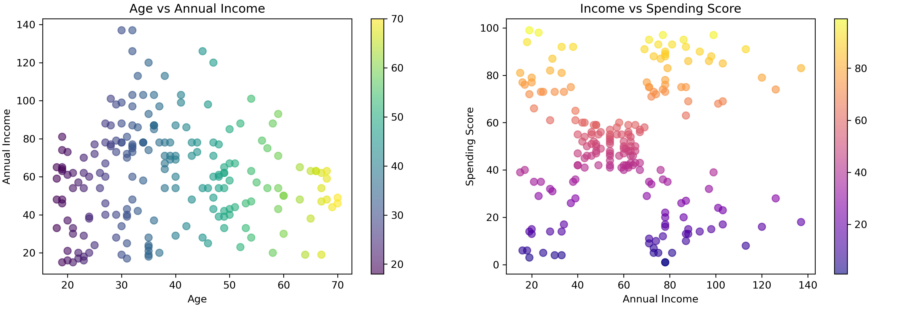

# Customer Segmentation with K-Means Clustering

**Goal:**  
To identify distinct customer segments based on annual income and spending behavior — enabling targeted marketing strategies.

## Dataset & Tools

- **Dataset:** [Mall Customers Dataset (Kaggle)](https://www.kaggle.com/datasets/vjchoudhary7/customer-segmentation-tutorial-in-python)  
  - 200 customers  
  - Features: `Annual Income (k$)`, `Spending Score (1-100)`, `Gender`, `Age`

- **Tools & Libraries:**  
  - Python, Pandas, Matplotlib, Seaborn, Scikit-learn

  ## Exploratory Data Analysis

Visualized customer distribution by income and spending score:

**Insight:**  
Data shows 5 natural groupings — suggesting 5 distinct customer personas.

## Methodology

1. **Feature Selection:** Used `Annual Income` and `Spending Score` for clustering.
2. **Feature Scaling:** Applied `StandardScaler` to ensure equal feature contribution.
3. **Optimal K Selection:** Used Elbow Method, optimal K=5.
4. **Clustering Algorithm:** K-Means (with `n_init=10`, `random_state=42`).
5. **Validation:** Visual cluster separation + business interpretation.