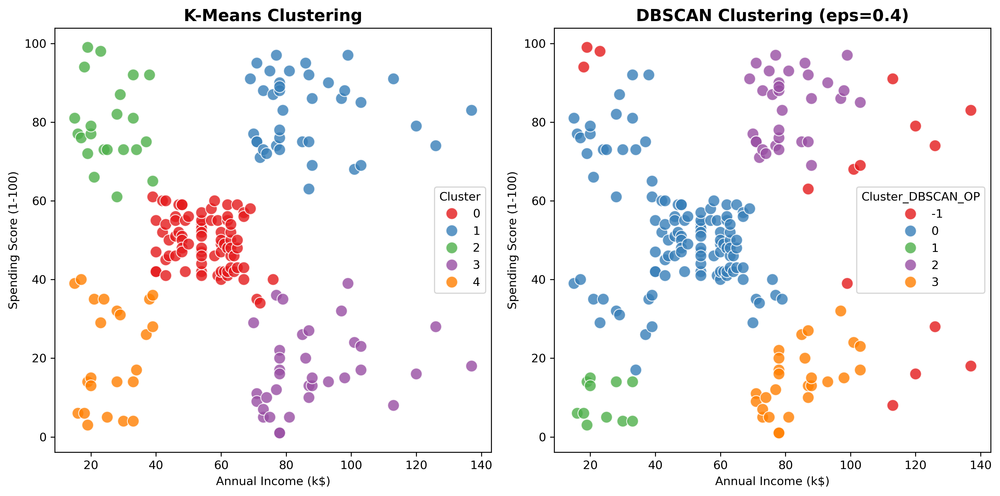

# Customer Segmentation with K-Means Clustering

**Goal:**  
To identify distinct customer segments based on annual income and spending behavior — enabling targeted marketing strategies.

## Dataset & Tools

- **Dataset:** [Mall Customers Dataset (Kaggle)](https://www.kaggle.com/datasets/vjchoudhary7/customer-segmentation-tutorial-in-python)  
  - 200 customers  
  - Features: `Annual Income (k$)`, `Spending Score (1-100)`, `Gender`, `Age`

- **Tools & Libraries:**  
  - Python, Pandas, Matplotlib, Seaborn, Scikit-learn

  ## Exploratory Data Analysis

Visualized customer distribution by income and spending score:

**Insight:**  
Data shows 5 natural groupings — suggesting 5 distinct customer personas.

## Methodology

1. **Feature Selection:** Used `Annual Income` and `Spending Score` for clustering.
2. **Feature Scaling:** Applied `StandardScaler` to ensure equal feature contribution.
3. **Optimal K Selection:** Used Elbow Method, optimal K=5.
4. **Clustering Algorithm:** K-Means (with `n_init=10`, `random_state=42`).
5. **Validation:** Visual cluster separation + business interpretation.

## Results & Cluster Interpretation

Trained K-Means with K=5. Clusters are well-separated and interpretable.

### Cluster Summary:

| Cluster | Avg Income (k$) | Avg Spending Score | Size | Persona |
|---------|------------------|---------------------|------|---------|
| 0       | 25.7             | 79.4                | 39   |Budget-stretched Customers (Low income, high spending) |
| 1       | 55.3             | 49.5                | 35   | Average Customers (Medium income, medium spending) |
| 2       | 86.5             | 82.1                | 39   | Premium Customers (High income, high spending) |
| 3       | 88.2             | 17.1                | 51   | Conservative Customers (High income, low spending) |
| 4       | 26.3             | 20.9                | 36   | Basic needs Customers (Low income, low spending) |

> "Each cluster represents a unique customer persona, enabling personalized marketing campaigns."

## Bonus: DBSCAN Comparison

Tried DBSCAN with `eps=0.4`, `min_samples=5`:

- Found 5 clusters + 15 outliers (7.5%)
- Cluster shapes more flexible, but less clean than K-Means
- Disagreement rate with K-Means: 46%

**Decision:** Chose K-Means for final segmentation — cleaner, more interpretable, no outliers.

## Business Insights & Recommendations

1. **Cluster 2 (Premium Customers):**  
   - High value customers, Offer premium loyalty rewards, early access to new products.

2. **Cluster 0 (Budget-stretched Customers):**  
   - Impulse buyers, Target with flash sales, limited-time offers.

3. **Cluster 3 (Conservative Customers):**  
   - High income, low spending, Emphasize quality, exclusivity, long-term value.

4. **Cluster 4 (Basic needs Customers):**  
   - Price-sensitive, Offer discounts, bundle deals, value packs.

5. **Cluster 1 (Average Customers):**  
   - Upsell opportunities,  Recommend mid-tier products, subscription plans.

